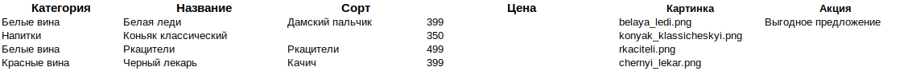

# Новое русское вино

Сайт магазина авторского вина "Новое русское вино".

## Запуск

- Скачайте код
- Скачайте или создайте excel файл с данными о напитках по образцу:




- Запустите сайт командой

```python3 main.py [имя файла excel]```

Например:

```python3 main.py wine.xlxs```

- Перейдите на сайт по адресу [http://127.0.0.1:8000](http://127.0.0.1:8000).

## Цели проекта

Код написан в учебных целях — это урок в курсе по Python и веб-разработке на сайте [Devman](https://dvmn.org).
